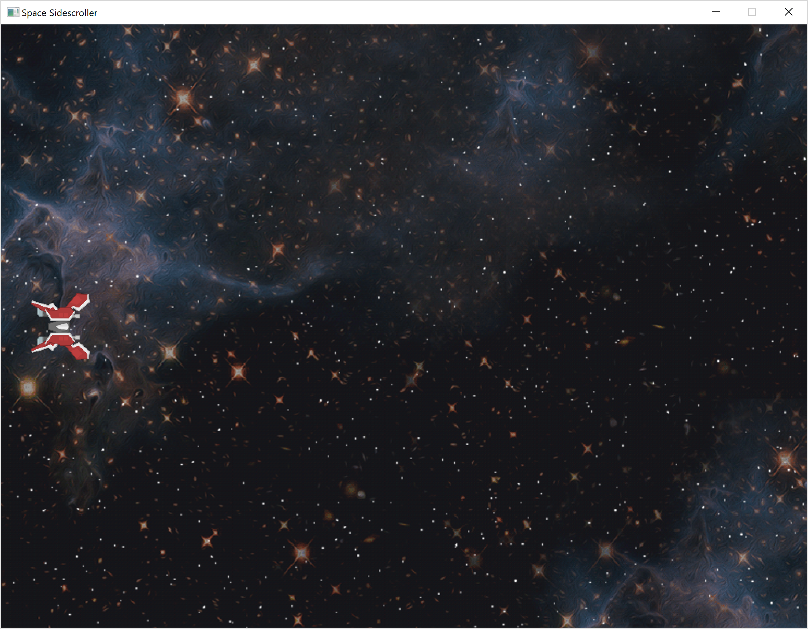

# CPP SideScroller
Simple side scroller made in C++ with visual studios using SDL and C++11.



# Classes

* Actor - base class for all Actors
  * Ship - player ship
* Game - initializes renderer + Actors and runs main update loop
* Main - simple wrapper around the game loop
* Math - From Game Programming in C++ by Sanjay Madhav (see file for licensing)
* Component - base class using dependency injection for dynamically adding components to actors
  * SpriteComponent - adds a sprite to an actor with a specific renderOrder
    * BGSpriteComponent - vector of textures that also allow scrolling backgrounds
    
# Licensing

- Background sprites were made by [Jacob Zinman-Jeanes](http://jeanes.co) licensed under [CC BY 3.0](http://creativecommons.org/licenses/by/3.0/)
- Math.h and derivative files by Sanjay Madhav (see LICENSE2.txt)

# Features

- Player movement
  - controlled via WASD
  - limited to window
- Scrolling backgrounds
  - foreground and background textures moving at different speeds

# Questions
**Q:** How does sprite creation work since we don't directly pass in a reference to the game?For example, when we load the ship instance in the LoadData function in the Game class we don't load the sprite.

**A:** The ship class in it's constructor creates a sprite component and uses dependency injection to not only add the component to the actor's (ship) internal list of components but also adds the sprite component to list of sprites the game will render. This is a result of having eaching actor also have a reference to the main Game class. 

```C++
//in ship constructor
SpriteComponent* sprite = new SpriteComponent(this, 150);	

//in SpriteComponent constructor
//where mOwner is an Actor
mOwner->GetGame()->AddSprite(this);

//addSprite in Game.cpp
void Game::AddSprite(class SpriteComponent* sprite) {
	int myDrawOrder = sprite->GetDrawOrder();
	auto iter = mSprites.begin();
	for ( ; iter != mSprites.end(); ++iter) {
		if (myDrawOrder < (*iter)->GetDrawOrder()) {
			break;
		}
	}

	// Inserts element before position of iterator
	mSprites.insert(iter, sprite);
}
```


